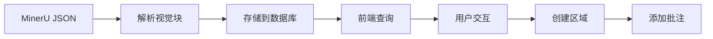

# 🔌 API 设计与使用指南

## 📋 概述

本项目的 API 设计遵循 RESTful 原则，提供了完整的视觉块批注系统后端接口。所有 API 都位于 `server/api/` 目录下，使用 Nuxt 3 的服务器端 API 功能。

## 🗂️ API 结构

```
server/api/
├── blocks.get.ts          # 获取视觉块列表
├── init-db.post.ts        # 初始化数据库
├── regions.post.ts        # 创建区域
└── annotations.post.ts    # 创建批注
```

## 📊 数据流程



## 🔍 API 端点详情

### 1. 获取视觉块 - `GET /api/blocks`

获取所有视觉块数据。

#### 请求

```http
GET /api/blocks
```

#### 响应

```json
{
  "blocks": [
    {
      "id": 1,
      "pageIndex": 0,
      "blockIndex": 0,
      "type": "title",
      "bbox": "[169, 312, 322, 355]",
      "content": "数学分析",
      "level": 1,
      "parentId": null,
      "createdAt": 1699123456789,
      "updatedAt": 1699123456789
    }
  ]
}
```

#### 实现

```typescript
// server/api/blocks.get.ts
import { db, visualBlocks } from '~/db'

export default defineEventHandler(async (event) => {
  try {
    const blocks = await db.select().from(visualBlocks)
    return { blocks }
  } catch (error) {
    throw createError({
      statusCode: 500,
      statusMessage: 'Failed to fetch visual blocks'
    })
  }
})
```

### 2. 初始化数据库 - `POST /api/init-db`

从 MinerU 数据文件初始化数据库。

#### 请求

```http
POST /api/init-db
Content-Type: application/json
```

#### 响应

```json
{
  "success": true,
  "message": "Successfully initialized 1250 visual blocks",
  "count": 1250
}
```

#### 实现细节

```typescript
// server/api/init-db.post.ts
import { db, visualBlocks } from '~/db'
import { parseMiddleJsonToBlocks, type MiddleJsonData } from '~/utils/pdf-parser'
import fs from 'fs'
import path from 'path'

export default defineEventHandler(async (event) => {
  try {
    // 读取 MinerU 数据文件
    const filePath = path.join(process.cwd(), 'public/data/middle.json')
    const fileContent = fs.readFileSync(filePath, 'utf-8')
    const data: MiddleJsonData = JSON.parse(fileContent)
    
    // 解析为视觉块数据
    const blocks = parseMiddleJsonToBlocks(data)
    
    // 批量插入到数据库
    const insertedBlocks = await Promise.all(
      blocks.map(async (block) => {
        return await db.insert(visualBlocks).values({
          pageIndex: block.pageIndex,
          blockIndex: block.blockIndex,
          type: block.type,
          bbox: block.bbox,
          content: block.content,
          level: block.level,
          parentId: block.parentId
        }).returning()
      })
    )
    
    return { 
      success: true, 
      message: `Successfully initialized ${blocks.length} visual blocks`,
      count: blocks.length
    }
  } catch (error: any) {
    throw createError({
      statusCode: 500,
      statusMessage: `Failed to initialize database: ${error.message}`
    })
  }
})
```

### 3. 创建区域 - `POST /api/regions`

创建新的视觉块区域。

#### 请求

```http
POST /api/regions
Content-Type: application/json

{
  "name": "数学定理",
  "rootBlockId": 1,
  "bbox": {
    "x": 100,
    "y": 200,
    "width": 300,
    "height": 150
  },
  "blockIds": [1, 2, 3]
}
```

#### 响应

```json
{
  "success": true,
  "region": {
    "id": 1,
    "name": "数学定理",
    "rootBlockId": 1,
    "bbox": "{\"x\":100,\"y\":200,\"width\":300,\"height\":150}",
    "createdAt": 1699123456789,
    "updatedAt": 1699123456789
  }
}
```

#### 实现

```typescript
// server/api/regions.post.ts
import { db, regions, regionBlocks } from '~/db'

export default defineEventHandler(async (event) => {
  const body = await readBody(event)
  const { name, rootBlockId, bbox, blockIds } = body

  try {
    // 创建区域
    const [region] = await db.insert(regions).values({
      name,
      rootBlockId,
      bbox: JSON.stringify(bbox)
    }).returning()

    // 创建区域-块关系
    if (blockIds && blockIds.length > 0) {
      await Promise.all(
        blockIds.map((blockId: number) =>
          db.insert(regionBlocks).values({
            regionId: region.id,
            blockId
          })
        )
      )
    }

    return { success: true, region }
  } catch (error: any) {
    throw createError({
      statusCode: 500,
      statusMessage: `Failed to create region: ${error.message}`
    })
  }
})
```

### 4. 创建批注 - `POST /api/annotations`

为指定区域创建批注。

#### 请求

```http
POST /api/annotations
Content-Type: application/json

{
  "regionId": 1,
  "content": "这是一个重要的数学定理",
  "type": "text",
  "position": {
    "x": 120,
    "y": 220
  }
}
```

#### 响应

```json
{
  "success": true,
  "annotation": {
    "id": 1,
    "regionId": 1,
    "content": "这是一个重要的数学定理",
    "type": "text",
    "position": "{\"x\":120,\"y\":220}",
    "isVisible": 1,
    "createdAt": 1699123456789,
    "updatedAt": 1699123456789
  }
}
```

#### 实现

```typescript
// server/api/annotations.post.ts
import { db, annotations } from '~/db'

export default defineEventHandler(async (event) => {
  const body = await readBody(event)
  const { regionId, content, type = 'text', position } = body

  try {
    const [annotation] = await db.insert(annotations).values({
      regionId,
      content,
      type,
      position: position ? JSON.stringify(position) : null,
      isVisible: 1
    }).returning()

    return { success: true, annotation }
  } catch (error: any) {
    throw createError({
      statusCode: 500,
      statusMessage: `Failed to create annotation: ${error.message}`
    })
  }
})
```

## 📝 数据类型定义

### 视觉块 (Visual Block)

```typescript
interface VisualBlock {
  id: number
  pageIndex: number       // 页面索引（从0开始）
  blockIndex: number      // 块在页面中的索引
  type: string           // 块类型：title, text, image, table等
  bbox: string           // JSON格式的边界框 [x, y, width, height]
  content?: string       // 文本内容
  level: number          // 层级（用于树形结构）
  parentId?: number      // 父节点ID
  createdAt: number      // 创建时间戳
  updatedAt: number      // 更新时间戳
}
```

### 区域 (Region)

```typescript
interface Region {
  id: number
  name?: string          // 可选的区域名称
  rootBlockId: number    // 根节点视觉块ID
  bbox: string          // JSON格式的区域边界框
  createdAt: number
  updatedAt: number
}
```

### 批注 (Annotation)

```typescript
interface Annotation {
  id: number
  regionId: number       // 关联的区域ID
  content: string        // 批注内容
  type: string          // 批注类型：text, highlight, comment等
  position?: string     // JSON格式的位置信息
  isVisible: number     // 是否可见 (1/0)
  createdAt: number
  updatedAt: number
}
```

## 🔒 错误处理

### 标准错误响应格式

```json
{
  "statusCode": 500,
  "statusMessage": "Failed to fetch visual blocks",
  "data": {
    "error": "Database connection failed"
  }
}
```

### 常见错误码

- `400` - 请求参数错误
- `404` - 资源不存在
- `500` - 服务器内部错误

### 错误处理最佳实践

```typescript
export default defineEventHandler(async (event) => {
  try {
    // API 逻辑
  } catch (error: any) {
    // 记录错误
    console.error('API Error:', error)
    
    // 返回友好的错误信息
    throw createError({
      statusCode: error.statusCode || 500,
      statusMessage: error.message || 'Internal Server Error',
      data: {
        error: process.env.NODE_ENV === 'development' ? error.stack : undefined
      }
    })
  }
})
```

## 🧪 API 测试

### 使用 curl 测试

```bash
# 获取视觉块
curl http://localhost:3000/api/blocks

# 初始化数据库
curl -X POST http://localhost:3000/api/init-db

# 创建区域
curl -X POST http://localhost:3000/api/regions \
  -H "Content-Type: application/json" \
  -d '{
    "name": "测试区域",
    "rootBlockId": 1,
    "bbox": {"x": 100, "y": 200, "width": 300, "height": 150},
    "blockIds": [1, 2, 3]
  }'

# 创建批注
curl -X POST http://localhost:3000/api/annotations \
  -H "Content-Type: application/json" \
  -d '{
    "regionId": 1,
    "content": "这是一个测试批注",
    "type": "text"
  }'
```

### 前端调用示例

```typescript
// 获取视觉块
const { data: blocks } = await $fetch('/api/blocks')

// 初始化数据库
await $fetch('/api/init-db', { method: 'POST' })

// 创建区域
const region = await $fetch('/api/regions', {
  method: 'POST',
  body: {
    name: '重要内容',
    rootBlockId: 1,
    bbox: { x: 100, y: 200, width: 300, height: 150 },
    blockIds: [1, 2, 3]
  }
})

// 创建批注
const annotation = await $fetch('/api/annotations', {
  method: 'POST',
  body: {
    regionId: region.id,
    content: '这段内容很重要',
    type: 'text'
  }
})
```

## 🚀 性能优化

### 1. 数据库查询优化

```typescript
// 使用索引优化查询
const pageBlocks = await db
  .select()
  .from(visualBlocks)
  .where(eq(visualBlocks.pageIndex, pageIndex))
  .orderBy(visualBlocks.blockIndex)

// 批量操作
const blocks = await db.insert(visualBlocks).values(blockArray)
```

### 2. 缓存策略

```typescript
// 使用 Nuxt 内置缓存
export default defineCachedEventHandler(async (event) => {
  // API 逻辑
}, {
  maxAge: 60 * 5, // 5分钟缓存
  name: 'blocks',
  getKey: () => 'all-blocks'
})
```

### 3. 分页查询

```typescript
// 分页获取视觉块
export default defineEventHandler(async (event) => {
  const query = getQuery(event)
  const page = Number(query.page) || 1
  const limit = Number(query.limit) || 50
  const offset = (page - 1) * limit

  const blocks = await db
    .select()
    .from(visualBlocks)
    .limit(limit)
    .offset(offset)

  return { blocks, page, limit }
})
```

## 📚 扩展功能

### 1. 认证中间件

```typescript
// middleware/auth.ts
export default defineEventHandler(async (event) => {
  if (event.node.req.url?.startsWith('/api/')) {
    const token = getCookie(event, 'auth-token')
    if (!token) {
      throw createError({
        statusCode: 401,
        statusMessage: 'Unauthorized'
      })
    }
  }
})
```

### 2. 数据验证

```typescript
import { z } from 'zod'

const createRegionSchema = z.object({
  name: z.string().optional(),
  rootBlockId: z.number(),
  bbox: z.object({
    x: z.number(),
    y: z.number(),
    width: z.number(),
    height: z.number()
  }),
  blockIds: z.array(z.number())
})

export default defineEventHandler(async (event) => {
  const body = await readBody(event)
  const validatedData = createRegionSchema.parse(body)
  // 处理验证后的数据
})
```

### 3. WebSocket 支持

```typescript
// 实时协作功能
export default defineWebSocketHandler({
  open(peer) {
    console.log('Client connected:', peer.id)
  },
  
  message(peer, message) {
    // 广播更新给所有客户端
    peer.publish('regions', message)
  }
})
```

## 🔧 开发工具

### API 文档生成

```typescript
// 使用 JSDoc 注释生成文档
/**
 * @swagger
 * /api/blocks:
 *   get:
 *     summary: 获取所有视觉块
 *     responses:
 *       200:
 *         description: 成功返回视觉块列表
 */
```

### 类型安全

```typescript
// 使用 TypeScript 确保类型安全
import type { VisualBlock } from '~/types/database'

export default defineEventHandler(async (event): Promise<{ blocks: VisualBlock[] }> => {
  // 实现
})
```

这个 API 设计文档提供了完整的后端接口说明，包括请求/响应格式、错误处理、测试方法和性能优化建议。 