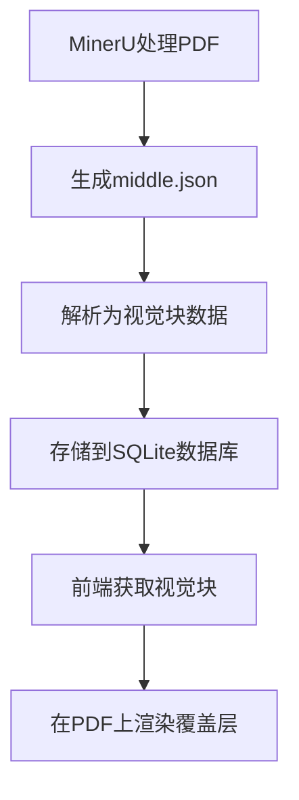
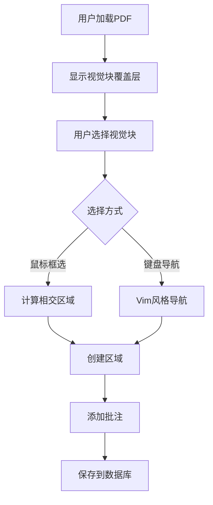
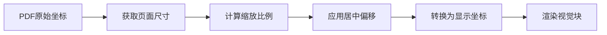
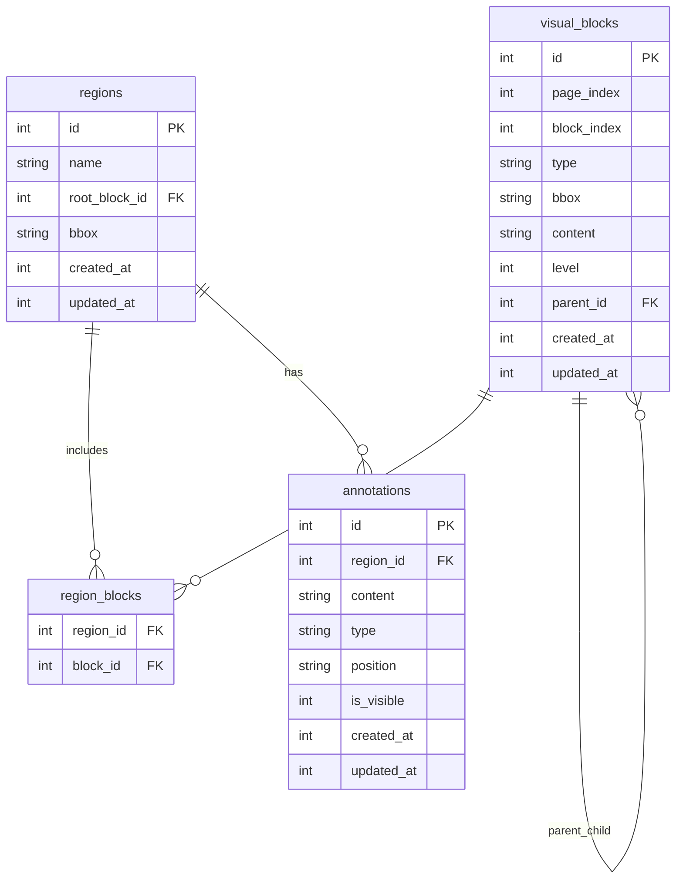

# 🏗️ 项目架构设计文档

## 📋 概述

本项目是一个基于视觉块的PDF批注系统，采用现代化的全栈Web应用架构。项目的核心思想是将传统的文本批注方式扩展到基于PDF布局结构的视觉块批注。

## 🎯 设计理念

### 核心概念

- **视觉块优先**: 以PDF的实际布局结构为基础，而非简单的文本选择
- **树形结构**: 所有视觉块组成层次化的树形结构
- **区域批注**: 批注对象是由多个视觉块组成的区域，而非单个文本片段
- **精确对位**: 使用精确的坐标转换确保视觉块与PDF内容完美对齐

### 技术哲学

1. **渐进增强**: 从基本的PDF查看功能开始，逐步增加批注功能
2. **组件化**: 高度模块化的组件设计，便于维护和扩展
3. **类型安全**: 全链路TypeScript，确保开发和运行时的类型安全
4. **现代化部署**: 设计为可无缝部署到现代云平台

## 🏛️ 整体架构

```
┌─────────────────────────────────────────────────────────┐
│                    Browser (Client)                     │
├─────────────────────────────────────────────────────────┤
│  Vue 3 Components                                       │
│  ├── VisualBlockAnnotator.vue (主要批注组件)            │
│  ├── PDFViewer (PDF渲染)                               │
│  └── AdminPanel (管理界面)                             │
├─────────────────────────────────────────────────────────┤
│  Nuxt 3 Framework                                       │
│  ├── Pages (路由页面)                                   │
│  ├── Composables (可复用逻辑)                          │
│  └── Utils (工具函数)                                   │
├─────────────────────────────────────────────────────────┤
│  Server API (Nitro)                                     │
│  ├── /api/blocks (视觉块API)                           │
│  ├── /api/regions (区域API)                            │
│  └── /api/annotations (批注API)                        │
├─────────────────────────────────────────────────────────┤
│  Database Layer                                          │
│  ├── Drizzle ORM (查询构建)                            │
│  ├── LibSQL Client (数据库连接)                        │
│  └── SQLite Database (数据存储)                        │
├─────────────────────────────────────────────────────────┤
│  External Data Sources                                   │
│  ├── MinerU JSON (布局数据)                            │
│  ├── Original PDF (文档文件)                           │
│  └── PDF.js Worker (PDF处理)                           │
└─────────────────────────────────────────────────────────┘
```

## 📁 目录结构详解

```
box-selection/
├── components/                 # Vue组件
│   └── VisualBlockAnnotator.vue    # 主要批注组件
├── pages/                     # 路由页面
│   ├── index.vue                   # 主页
│   ├── annotator.vue               # 批注系统
│   ├── admin.vue                   # 管理页面
│   └── read-all.vue                # PDF查看器
├── server/                    # 服务器端代码
│   └── api/                        # API端点
│       ├── blocks.get.ts           # 获取视觉块
│       ├── init-db.post.ts         # 初始化数据库
│       ├── regions.post.ts         # 创建区域
│       └── annotations.post.ts     # 创建批注
├── db/                        # 数据库相关
│   ├── schema.ts                   # 数据库模式
│   ├── index.ts                    # 数据库连接
│   ├── migrations/                 # 迁移文件
│   └── sqlite.db                   # SQLite数据库文件
├── utils/                     # 工具函数
│   └── pdf-parser.ts              # PDF数据解析
├── docs/                      # 项目文档
│   ├── database-setup.md          # 数据库配置文档
│   ├── api-design.md              # API设计文档
│   └── architecture.md            # 架构文档（本文件）
├── public/                    # 静态资源
│   ├── data/                      # PDF和布局数据
│   │   ├── origin.pdf             # 原始PDF文件
│   │   └── middle.json            # MinerU布局数据
│   └── pdf.worker.min.mjs         # PDF.js Worker
└── drizzle.config.ts         # Drizzle ORM配置
```

## 🔄 数据流程

### 1. 数据初始化流程



### 2. 用户交互流程



### 3. 坐标转换流程



## 🧩 核心组件设计

### VisualBlockAnnotator.vue

这是系统的核心组件，负责整合PDF渲染、视觉块显示和用户交互。

```typescript
// 主要职责
interface VisualBlockAnnotator {
  // PDF 渲染
  loadPdf(): Promise<void>
  renderPage(pageNum: number): Promise<void>
  
  // 坐标转换
  convertCoordinates(bbox: Bbox): DisplayCoords | null
  updateOverlayDimensions(): void
  
  // 用户交互
  handleMouseSelection(event: MouseEvent): void
  handleKeyboardNavigation(event: KeyboardEvent): void
  
  // 区域管理
  createRegion(blockIds: number[]): void
  deleteRegion(regionId: number): void
  
  // 批注管理
  updateAnnotation(regionId: number, content: string): void
}
```

### PDF坐标转换系统

坐标转换是系统的核心技术难点，确保视觉块与PDF内容精确对齐。

```typescript
// 坐标转换算法
function convertCoordinates(bbox: Bbox): DisplayCoords {
  // 1. 获取页面原始尺寸
  const [pageWidth, pageHeight] = getCurrentPageSize()
  
  // 2. 计算缩放比例（保持宽高比）
  const scaleX = canvasWidth / pageWidth
  const scaleY = canvasHeight / pageHeight
  const scale = Math.min(scaleX, scaleY)
  
  // 3. 计算实际渲染尺寸
  const renderWidth = pageWidth * scale
  const renderHeight = pageHeight * scale
  
  // 4. 计算居中偏移
  const centerOffsetX = (canvasWidth - renderWidth) / 2
  const centerOffsetY = (canvasHeight - renderHeight) / 2
  
  // 5. 应用变换
  return {
    left: bbox.x * scale + offsetX + centerOffsetX,
    top: bbox.y * scale + offsetY + centerOffsetY,
    width: bbox.width * scale,
    height: bbox.height * scale
  }
}
```

## 🗄️ 数据库设计

### 表关系图



### 数据一致性保证

1. **事务处理**: 区域创建和块关联在同一事务中完成
2. **外键约束**: 确保引用完整性
3. **索引优化**: 为常用查询字段添加索引
4. **数据验证**: API层和数据库层双重验证

## 🔧 技术选型说明

### 前端技术栈

- **Nuxt 3**: 
  - 优势: 全栈框架，SSR/SPA支持，优秀的开发体验
  - 选择原因: 简化开发流程，内置API支持，部署友好
  
- **Vue 3 + TypeScript**:
  - 优势: 响应式系统，组合式API，完整的类型支持
  - 选择原因: 开发效率高，维护性强，生态丰富

- **PDF.js**:
  - 优势: 原生PDF渲染，跨平台兼容，功能完整
  - 选择原因: 无需插件，渲染质量高，可定制性强

### 后端技术栈

- **Nuxt Nitro**:
  - 优势: 统一的全栈开发体验，自动API路由，部署优化
  - 选择原因: 与前端集成无缝，开发效率高

- **SQLite + LibSQL**:
  - 优势: 零配置，文件数据库，高性能，事务支持
  - 选择原因: 简化部署，适合中小型应用，云部署友好

- **Drizzle ORM**:
  - 优势: 类型安全，SQL-like API，迁移管理，性能优秀
  - 选择原因: 现代化ORM，TypeScript优先，学习成本低

## 🚀 部署架构

### 开发环境

```
Developer Machine
├── Node.js 22.x
├── pnpm (包管理)
├── SQLite (本地数据库)
└── PDF.js Worker (本地文件)
```

### 生产环境 (Cloudflare Pages)

```
Cloudflare Edge Network
├── Static Assets (CDN)
├── Nuxt Application (Edge Functions)
├── Turso Database (分布式SQLite)
└── Environment Variables (配置管理)
```

### 部署流程


## 🔒 安全考虑

### 数据安全

1. **输入验证**: 所有用户输入都经过验证和清理
2. **SQL注入防护**: 使用参数化查询
3. **文件访问控制**: 限制PDF文件访问权限
4. **数据库备份**: 定期备份重要数据

### 访问控制

```typescript
// 未来扩展：认证中间件
export default defineEventHandler(async (event) => {
  if (event.node.req.url?.startsWith('/api/admin')) {
    // 验证管理员权限
    const isAdmin = await verifyAdminToken(event)
    if (!isAdmin) {
      throw createError({ statusCode: 403, statusMessage: 'Forbidden' })
    }
  }
})
```

## 📈 性能优化策略

### 前端优化

1. **懒加载**: 组件和路由懒加载
2. **虚拟滚动**: 大量视觉块的性能优化
3. **缓存策略**: API响应缓存
4. **图像优化**: PDF渲染优化

### 后端优化

1. **数据库索引**: 为常用查询添加索引
2. **连接池**: 数据库连接优化
3. **查询优化**: 避免N+1查询问题
4. **CDN加速**: 静态资源CDN部署

### 代码优化

```typescript
// 使用计算属性缓存复杂计算
const currentPageBlocks = computed(() => {
  return visualBlocks.value.filter(block => 
    block.pageIndex === pageNum.value - 1
  )
})

// 使用防抖优化频繁操作
const debouncedUpdateOverlay = debounce(updateOverlayDimensions, 100)
```

## 🔮 未来扩展计划

### 短期目标 (1-3个月)

- [ ] 自动视觉块层级划分算法
- [ ] 更多批注类型（高亮、箭头、图形）
- [ ] 批注导出功能
- [ ] 移动端适配

### 中期目标 (3-6个月)

- [ ] 多用户协作系统
- [ ] 实时同步功能
- [ ] 版本历史管理
- [ ] 高级搜索功能

### 长期目标 (6-12个月)

- [ ] AI辅助批注
- [ ] 跨文档关联
- [ ] 插件系统
- [ ] 企业级功能

## 🛠️ 开发规范

### 代码规范

```typescript
// 组件命名：PascalCase
export default defineComponent({
  name: 'VisualBlockAnnotator'
})

// 函数命名：camelCase
const convertCoordinates = (bbox: Bbox) => { }

// 常量命名：SCREAMING_SNAKE_CASE
const MAX_ZOOM_LEVEL = 5

// 接口命名：PascalCase + Interface后缀
interface VisualBlockInterface { }
```

### 文件组织

```
src/
├── components/        # 可复用组件
├── pages/            # 页面组件
├── composables/      # 可复用逻辑
├── utils/            # 工具函数
├── types/            # 类型定义
└── constants/        # 常量定义
```

### Git工作流

```
main              # 主分支，生产环境
├── develop       # 开发分支
├── feature/*     # 功能分支
├── bugfix/*      # 修复分支
└── release/*     # 发布分支
```

## 📚 学习资源

### 核心技术文档

- [Nuxt 3 官方文档](https://nuxt.com/docs)
- [Vue 3 官方文档](https://vuejs.org/guide/)
- [Drizzle ORM 文档](https://orm.drizzle.team/)
- [PDF.js 文档](https://mozilla.github.io/pdf.js/)

### 项目相关资源

- [MinerU 文档](https://mineru.readthedocs.io/)
- [LibSQL 文档](https://docs.turso.tech/libsql)
- [Cloudflare Pages 文档](https://developers.cloudflare.com/pages/)

这个架构文档为项目提供了全面的技术视图，涵盖了从设计理念到具体实现的各个方面，为团队开发和项目维护提供了重要参考。 